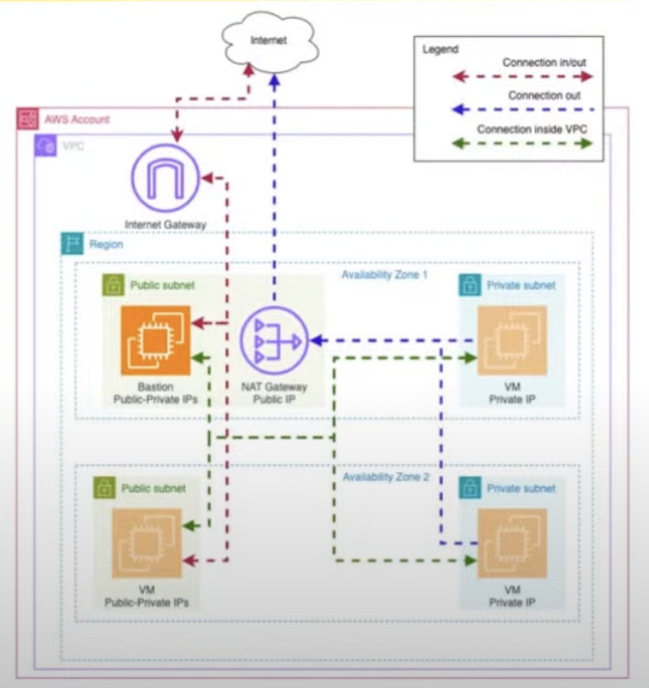
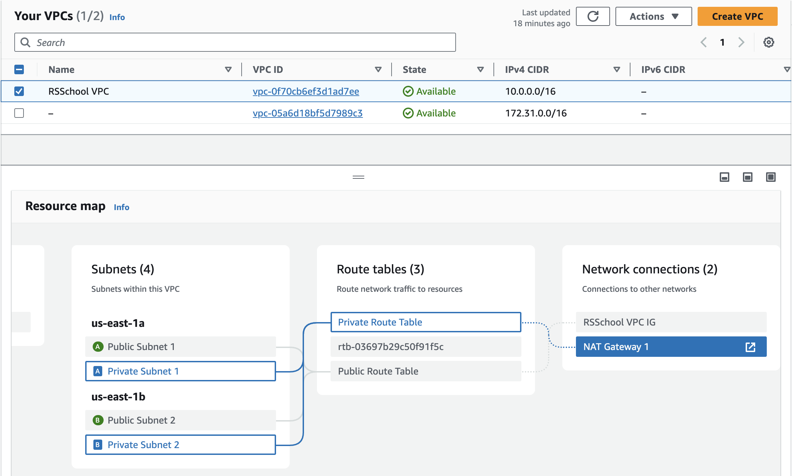
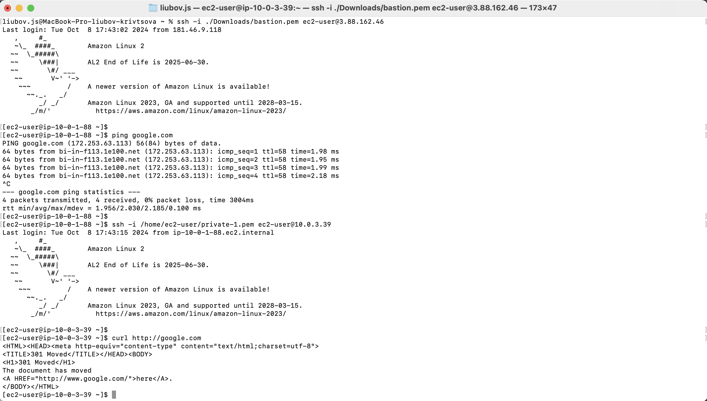

# rsschool-devops-course-tasks

## Task 2: Basic Infrastructure Configuration

Terraform code to configure the basic networking infrastructure required for a Kubernetes (K8s) cluster.

1. Created Terraform code to configure the following:

- VPC (virtual private cloud) in us-east-1 zone
- 2 public subnets in different AZs
- 2 private subnets in different AZs
- Internet Gateway
- Routing configuration:
  - Instances in all subnets can reach each other
  - Instances in public subnets can reach addresses outside VPC and vice-versa
    
- Security Groups and Network ACLs for the VPC and subnets
- NAT for private subnets, so instances in private subnet can connect with outside world. In the task, creating one NAT Gateway for practice is enough, but in production, we should create NAT for every subnet.
  

2. Set up a GitHub Actions (GHA) pipeline for the Terraform code.
